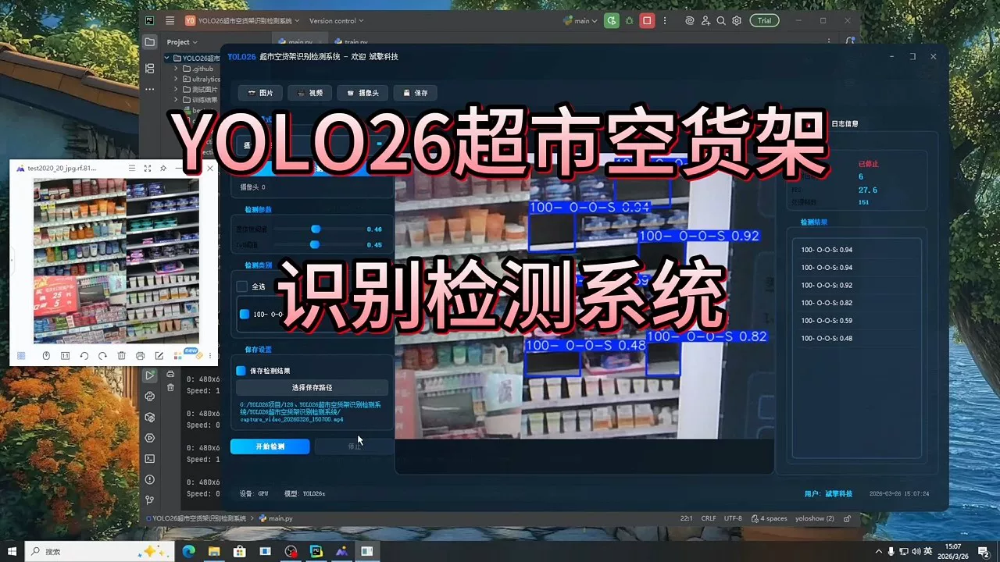
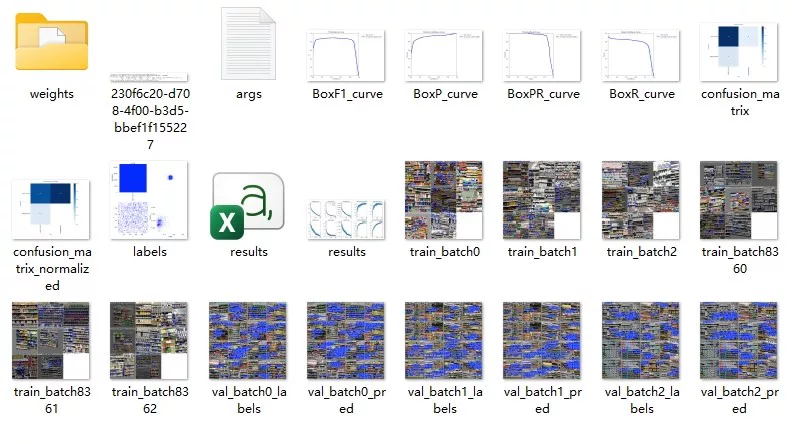
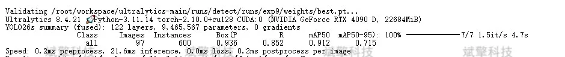
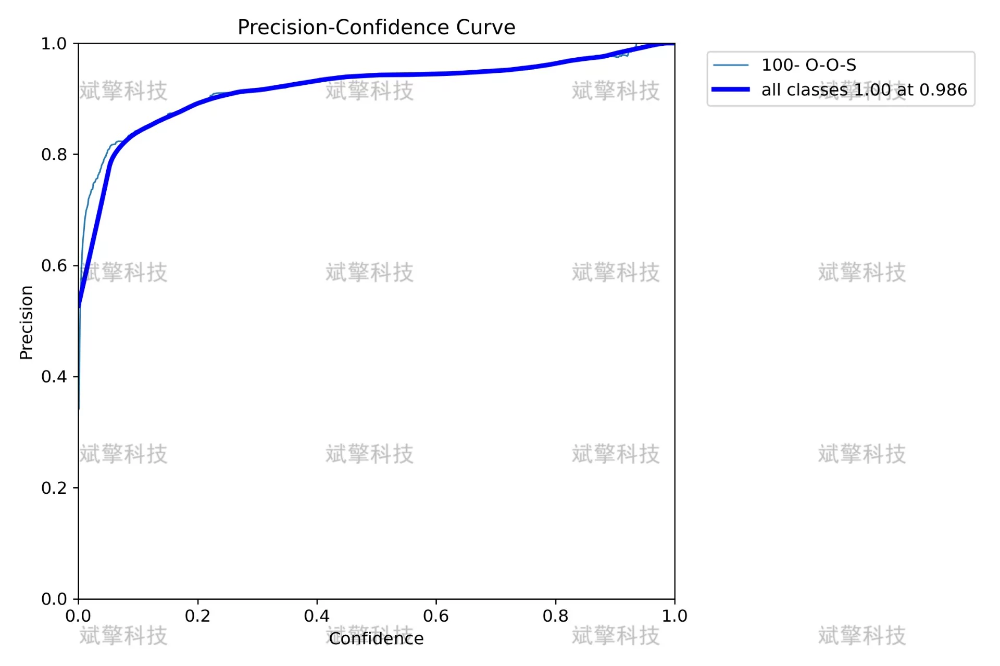
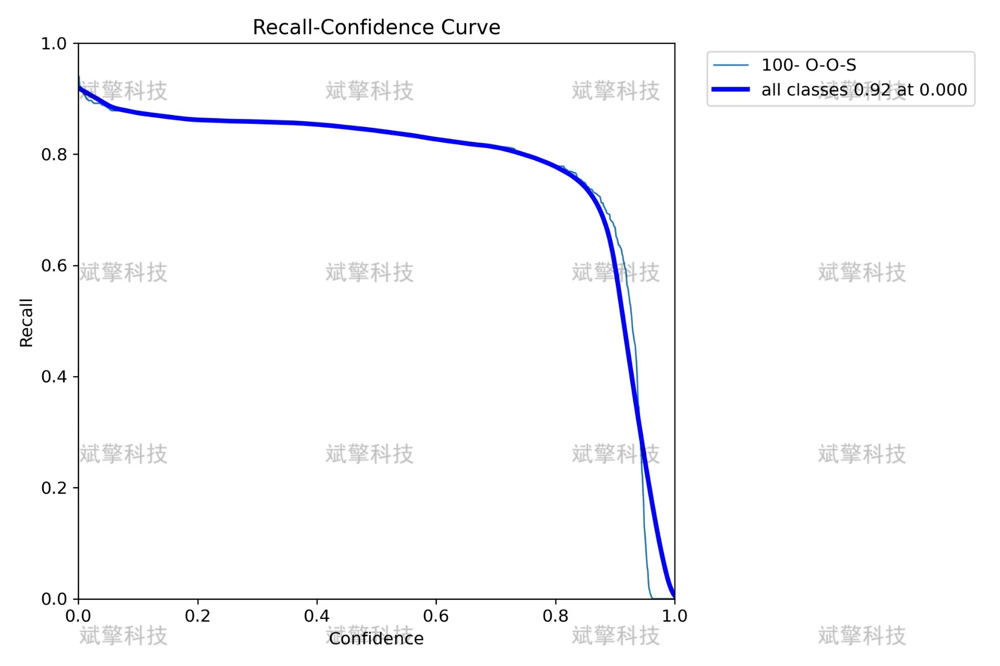
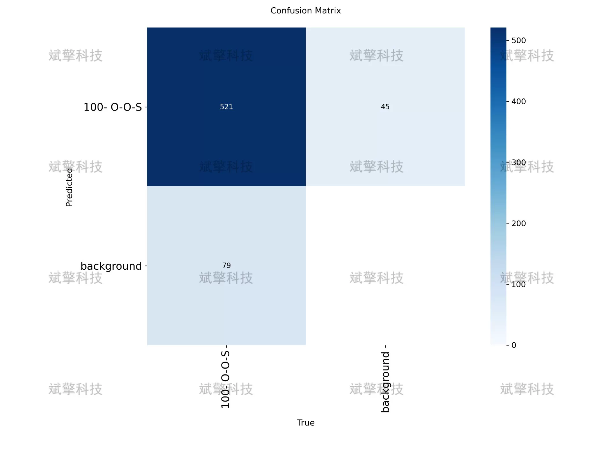
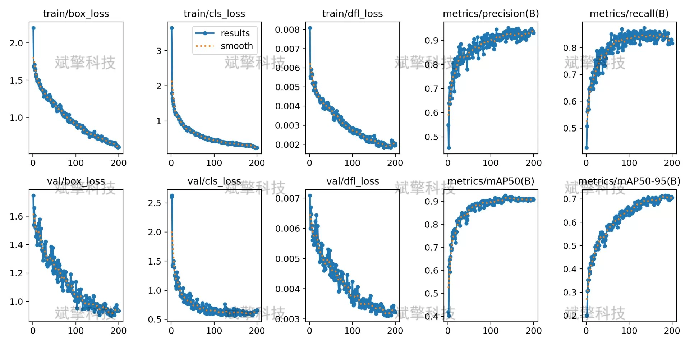
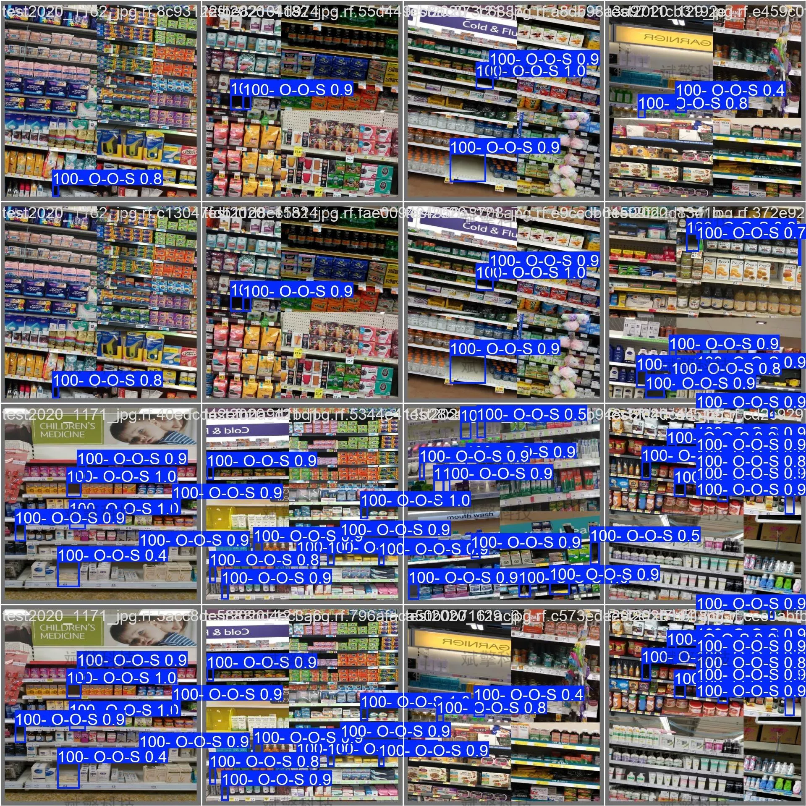

# YOLOv26 supermarket aisle-free shelf detection system | model

## Body

YOLO26 Supermarket Shelf Emptyness Recognition Detection System | Model YOLO26 Supermarket Shelf Emptyness Detection System: Single-Category Recognition, mAP50=0.912, Inference Time Only 21.6ms

With the acceleration of the intelligent transformation in the retail industry, there is an increasing demand for automated shelf monitoring in supermarket operations and management. Shelf emptyness recognition, as a key link in inventory management and restocking decision-making, directly affects customer shopping experience and supermarket operational efficiency. This study builds a supermarket scene-oriented shelf emptyness recognition detection system based on the YOLO26 object detection algorithm.
The system adopts a lightweight YOLO26 model architecture to detect the "100-O-O-S" single-category empty shelf state. The experimental dataset includes a training set of 350 images, a validation set of 97 images, and a test set of 50 images, totaling 497 labeled images. After 100 rounds of training, the model achieved detection accuracy of mAP50=0.912 and mAP50-95=0.715 on the validation set, with an accuracy of 0.936 and a recall rate of 0.852, and the inference time per image was only 21.6ms. The confusion matrix analysis showed that the positive detection rate of the model for empty shelves reached 87%, and the false alarm rate was controlled within 13%.
The experimental results verified the effectiveness and practicality of this system in the task of supermarket shelf emptyness recognition, providing a reliable technical solution for intelligent retail shelf management.

According to the standard process of model training, validation, and testing, the dataset was divided into three subsets:
Training set of 350 images (70.4%)
Validation set of 97 images (19.5%)
Test set of 50 images (10.1%)
The dataset uses a single-category labeling, with the category name "100-O-O-S," representing the target of empty shelves.

Free reservation for remote installation. Unsuccessful full refund.
Purchase Enjoy the following resources (auto-unlocked in Baidu Cloud):
   YOLO Identification Detection Project Complete Source Code
   YOLO format dataset
    Training code + UI interface code
    Trained model + result images
    Software installation package
    Add WeChat for remote installation (automatically displayed WeChat ID after purchase) - Unsuccessful, full refund

⚙️ Core Functional Modules
Detection Capability
    Image Detection: Upon upload, return detection boxes + category information
    Video Detection: Supports video files, analyzes frames accurately
    Camera Real-Time Detection: Connects USB cameras to achieve dynamic monitoring
Interaction and Control
    Target Filtering: Choose one or more categories for detection
    Parameter Real-Time Adjustment: Adjustable confidence threshold & IoU threshold, flexibly control precision
    Result Save: One-click save of images/videos/camera detection results
System and Data
    User login registration: Supports password strength detection + encryption storage
    Log recording: Auto-record operation and error information (timestamped)

## Images

## Payment

Here is a pay link on Stripe ( https://buy.stripe.com/3cs8yP7sY87d0vu9AB ). Please contact me lonlonago@foxmail.com after funding $89, and I will send you a complete data files , thank you!

